####                                  Screening Task 
###                             FOSSEE Summer Fellowship 2026 
##                                Python - UI/UX Enhancement

# What UI/UX enhancement I performed

I cloned the existing FOSSEE workshop booking website from the repository link provided into my own git repository (fossee-workshop-ui) and saw that its apperance was so basic with no mobile support, So I redesigned its frontend using React and Talwind CSS.The Original site was built with Django templates.I rebuilt the entire UI to make it modern,responsive and easier to use especially on mobile devices.

# Design Rules that helped me a lot 

* Mobile Responsive first . Firstly , I designed for small screens then scaled it up to the big level
* I Kept dark gray,navy blue and yellow as my  main colors throughout the project
  (yellow matches with the FOSSEE's identity, dark gray and navy blue looks professional)
* I followed the clear visual support that  important things are bigger, bolder and highlighted 
* I tried to be consistent with  spacing and padding across all pages
* Good color attracts for readability

# How I achieve Responsiveness

* I Used Tailwind CSS breakpoints (md: lg: and many more) throughout
* Navbar changes to the hamburger menu on mobile
* Workshop cards change from 1 column on mobile to 3 on desktop
* Forms are full width on mobile and max-width centered on desktop
* I tested everything on chrome DevTools mobile simulator at 375px width

# Trade-offs I Made

* I Chossed Tailwind CSS over custom CSS - faster to write but that is 
  less flexibility for very specific designs
* I Used static dummy data and information availabe on internet instead of connecting to   Django backend because my task was focused on UI/UX not the backend integration
* I tried to kept animations simple to maintain fast load time
* I tried to prioritized mobile experience over complex desktop layout

# Challenges which I faced during the task

* While set up the Tailwind CSS was not loading initially,I spend my lot of time debugging
  and found that it was a version conflict with React Script
* The React Router setup was confusing at first especially using the nested routes to connect the pages
* Navbar structure kept breaking when adding logo  had to redo the flex layout many times
* node_modules got pushed to GitHub accidentally u can see it in the commits ,I had to spent a lot of time in fixing it and removed cached files

## Pages that I had Redesigned

1. Home Page -  Hero section + Why FOSSEE section
2. Workshop List -  with search bar and level filter
3. Workshop Detail -  with venue, duration, prerequisites
4. Login - with real- time form validation
5. Register -  with college name field
6. Propose Workshop -  with phone number field
7. Statistics -  dark themed with impact numbers
8. Profile -  with enrolled workshops and status

## Features I Added

* Search bar on workshop list to make it more reliable
* Filter by level (Beginner/Intermediate/Advanced)
* Card hover lift effect
* Sticky navbar 
* FOSSEE logo in navbar
* Responsive hamburger menu for the Mobile

# Before/After Screenshots

# Pages That Existed Before and are redesigned by me

# 1. Home Page
# Desktop
| Before | After |
|--------|-------|
| 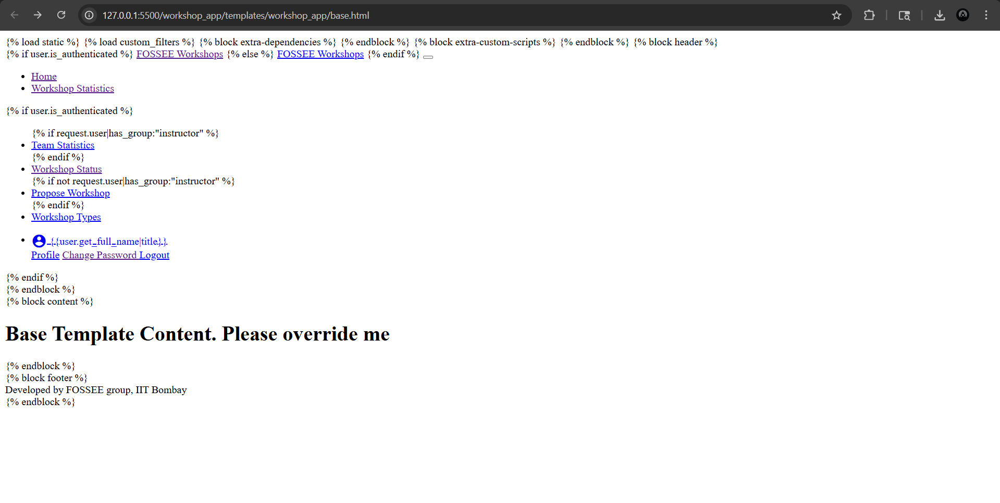 | 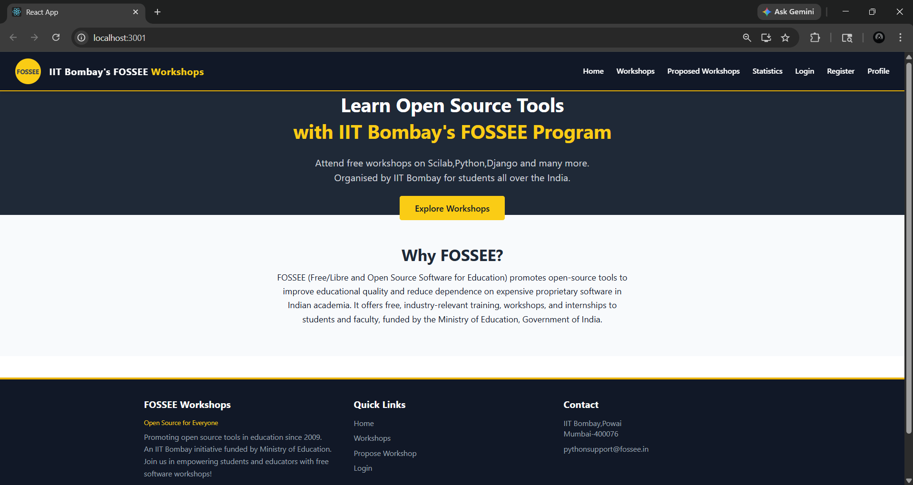 |

# Mobile

# 2. Login Page
# Desktop
| Before | After |
|--------|-------|
| 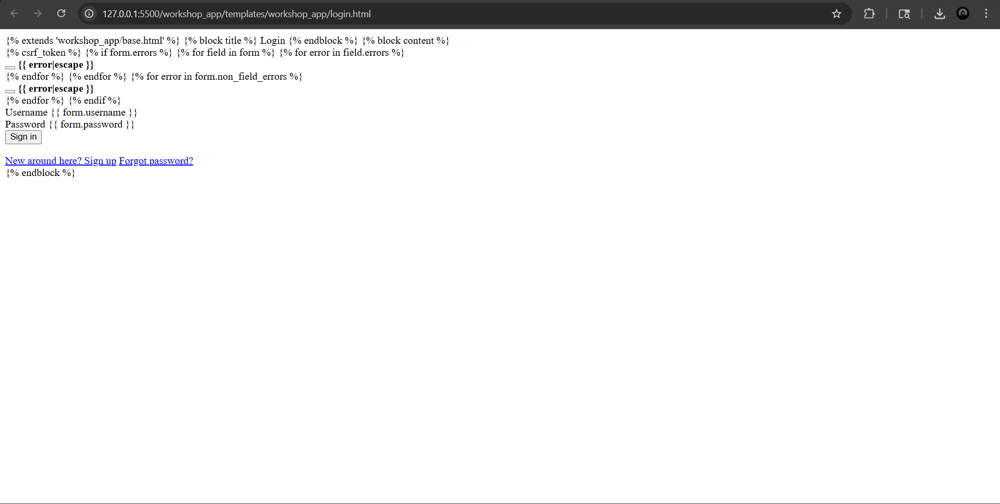 | 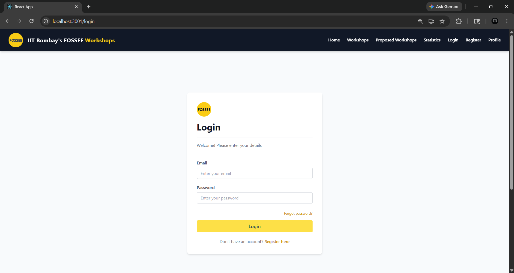 |

# Mobile
 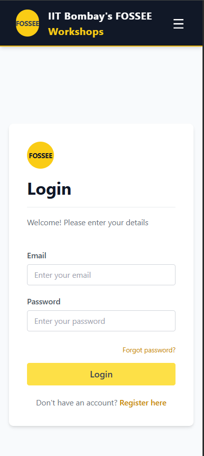 

# 3. Register Page
# Desktop
| Before | After |
|--------|-------|
| 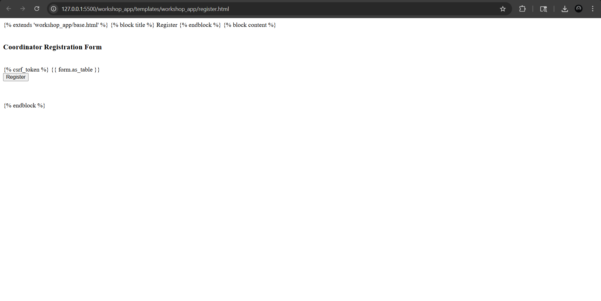 | 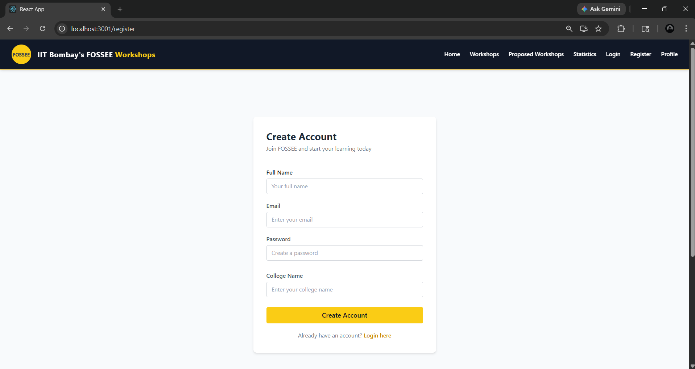 |

# Mobile
 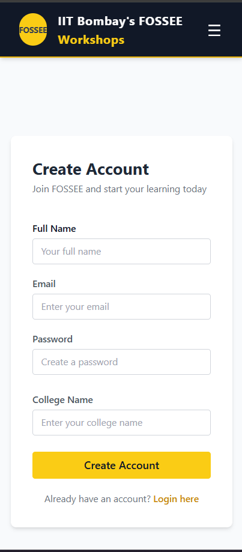 

# 4. Workshop List
# Desktop
| Before | After |
|--------|-------|
| 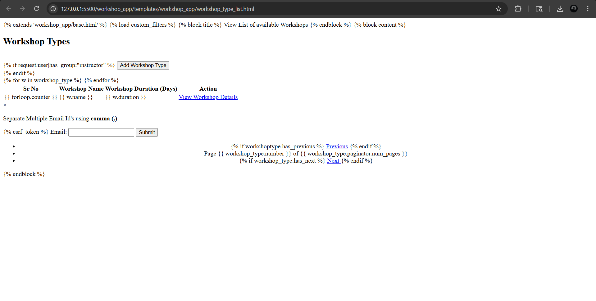 | 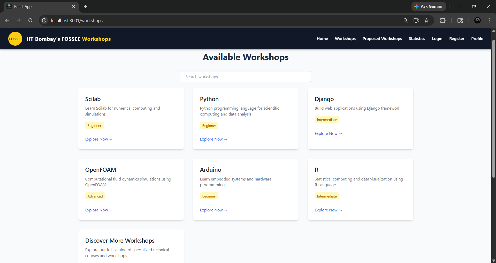 |

# Mobile
 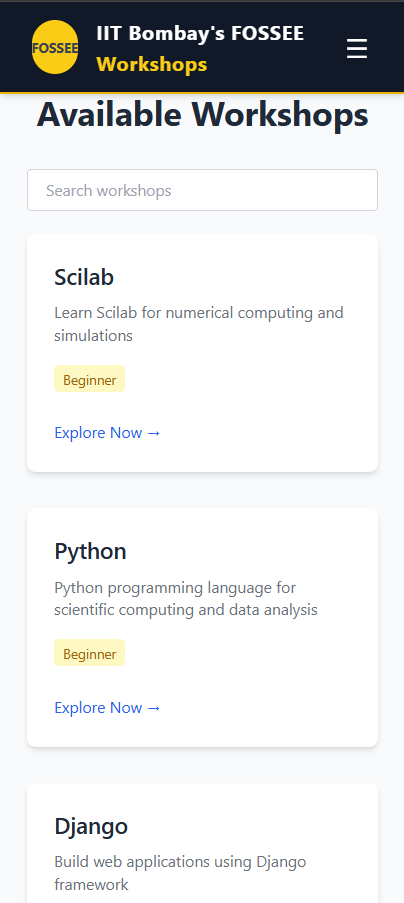 

# 5. Workshop Details
# Desktop
| Before | After |
|--------|-------|
|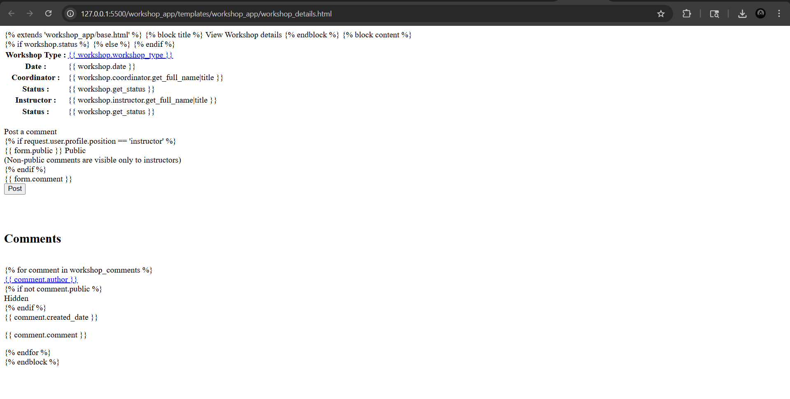 |  |

# Mobile
 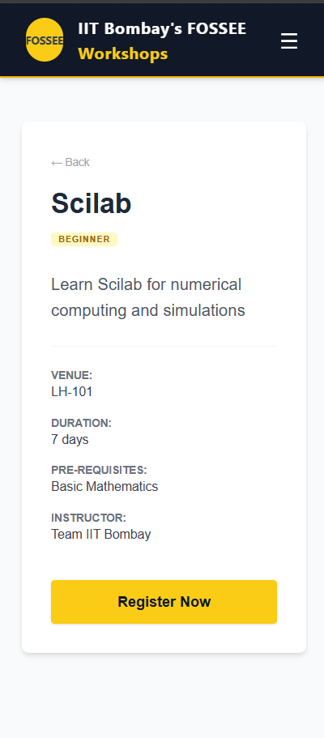 

# Pages that I added newly

# 6. Statistics Page
# Desktop
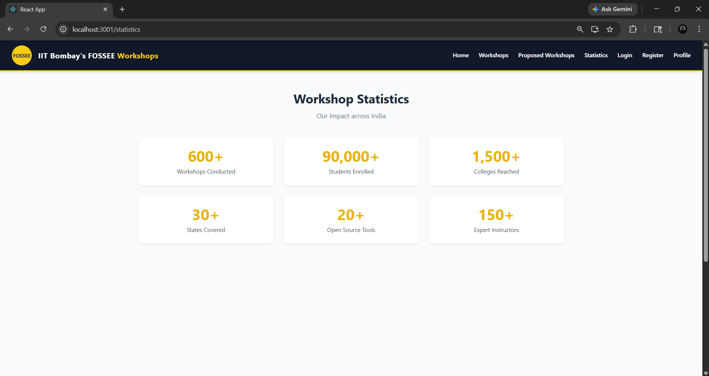

# Mobile
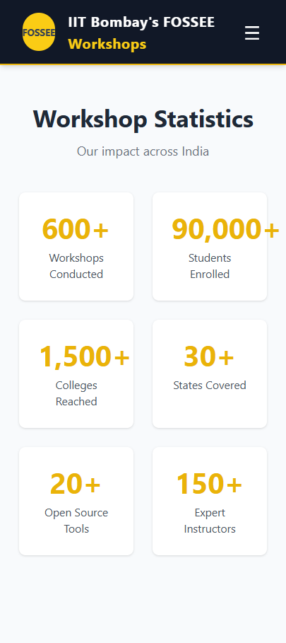

# 7. Propose Workshop Page
# Desktop
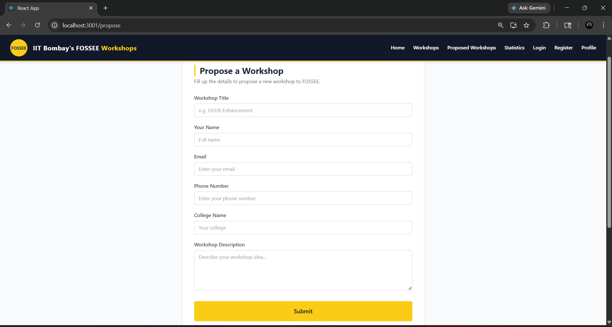

# Mobile
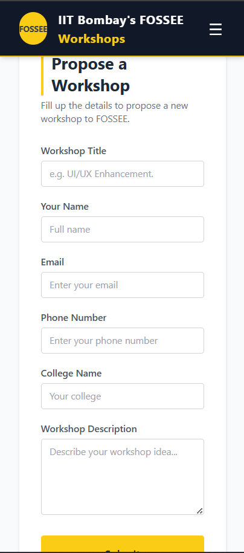

# 8. Profile Page
# Desktop
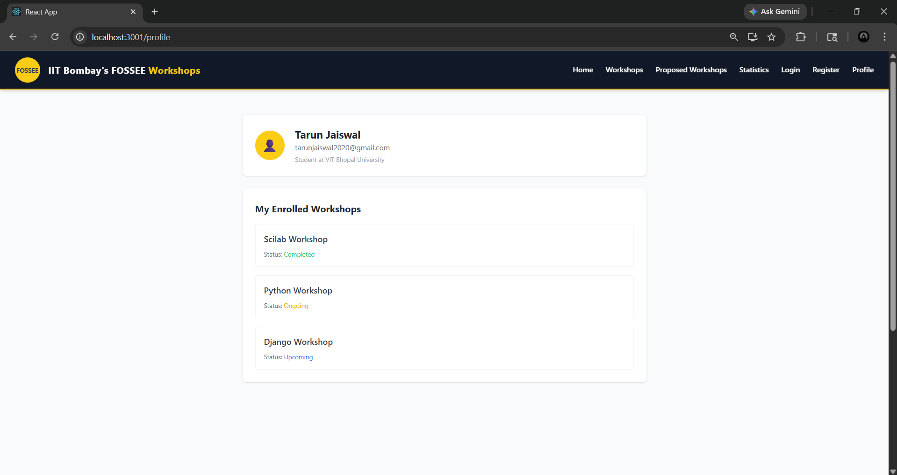

# Mobile
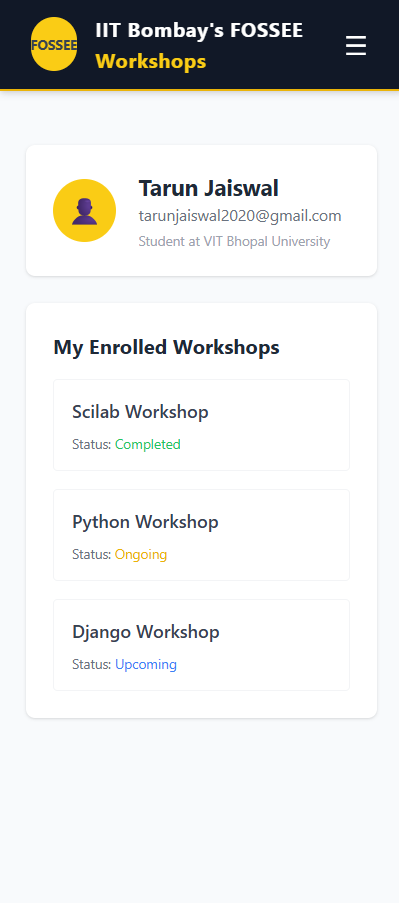

# Instructions for the setup 

1. Clone the repository

   git clone https://github.com/tarunjaiswal00/fossee-workshop-ui.git

2. Go to frontend folder

   cd frontend

3. Install dependencies

  npm install

4. Start the app

  npm start

5. Open browser at http://localhost:3000

# Tech Stack required

* React
* Tailwind CSS
* React Router DOM